# Laboratorio

> [Ver](https://eci.gitbook.io/workshops/parallelism-and-concurrency/bbp-formula)

**Compilar**

~~~
mvn -U package
~~~

**Ejecutar:**

~~~
mvn exec:java -Dexec.mainClass="edu.eci.arsw.math.Main"
~~~

## Solucion:

#### Parte 1: Introduccion a los Threads
- Cambie start() por run? cambia la salida? por que?
 
 **Al ejecutar run**
 
 
 
 Podemos ver que el codigo se ejecuta secuencial
 
 **Al ejecutar start**
 
 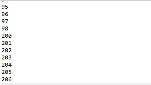
 
 Podemos evidenciar que el codigo se ejecuta en paralelo

#### Parte 2: BBP formula ejercicio 
 
 
#### Parte 3: Evaluacion de rendimiento

   Para la siguiente secuencia de experimentos calcular un millon de digitos 

- Un solo Thread

 **Threads**
 
 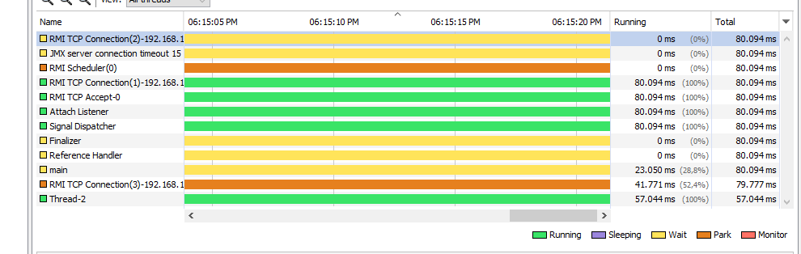
 
 
 **Monitor de recursos**
 
 
 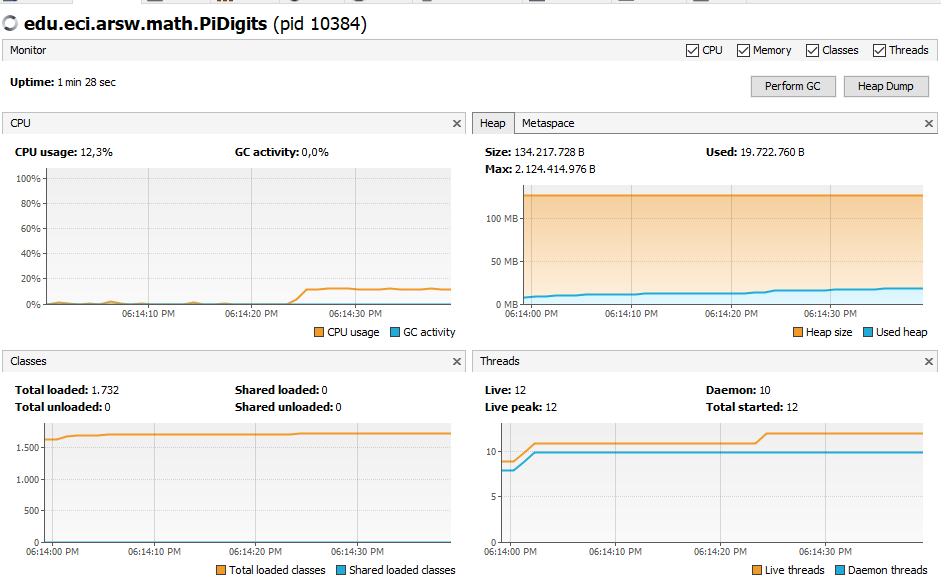
 
- Tantos hilos como cores tenga el equipo
 
 **Threads**
 
 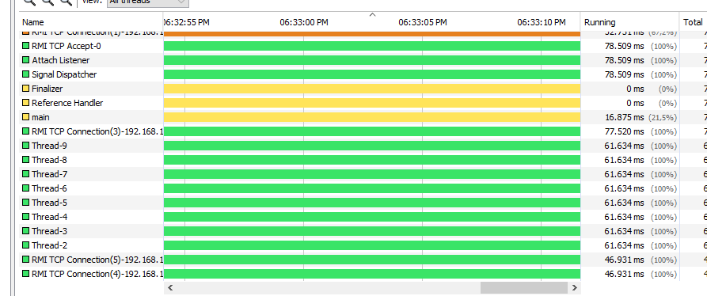
 
 **Monitor de recursos**
 
 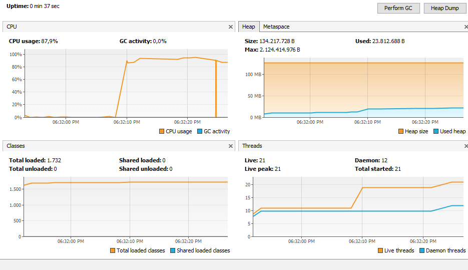
 
 - Que tenga tantos Threads como el doble de cores
 
 **Threads**
 
 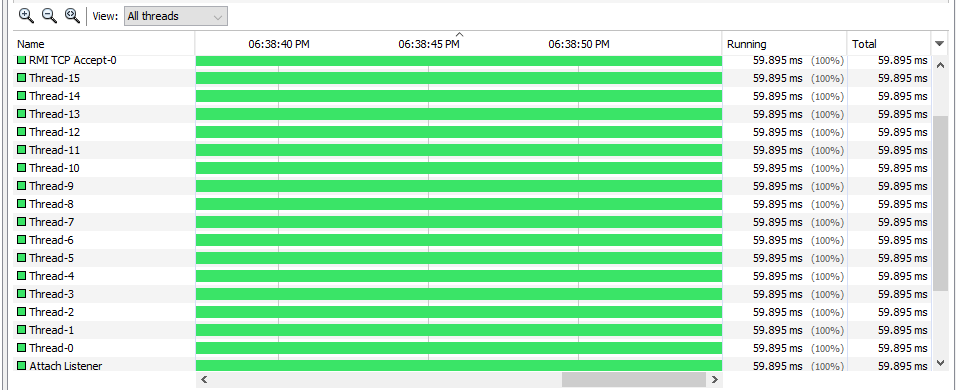
 
 **Monitor de recursos**
 
  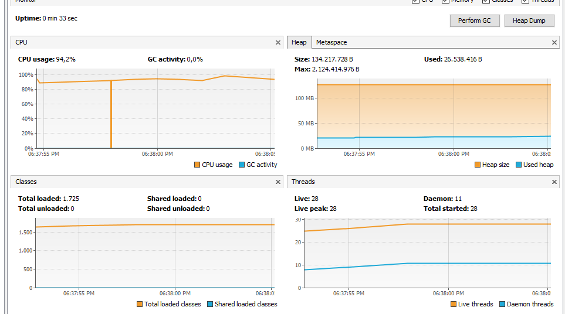
  
  - Que tenga 200 threads
  
  **Threads**
  
  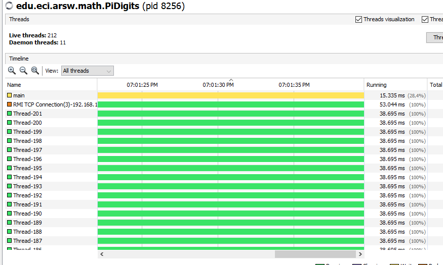
  
  **Monitor de recursos**
  
  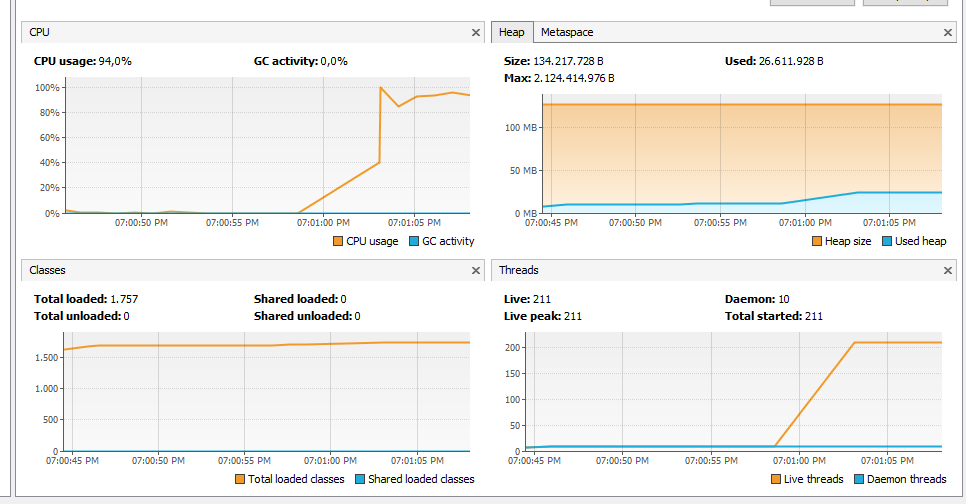
  
  - Que tenga 500 threads
  
 **Threads**
 
 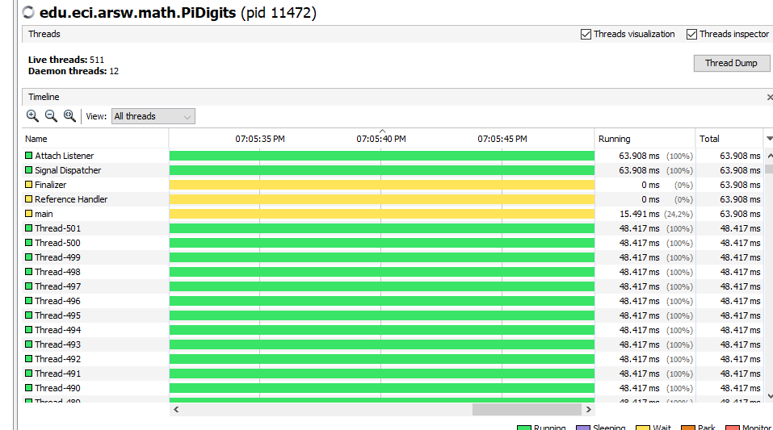
 
 **Monitor de recursos**
 
 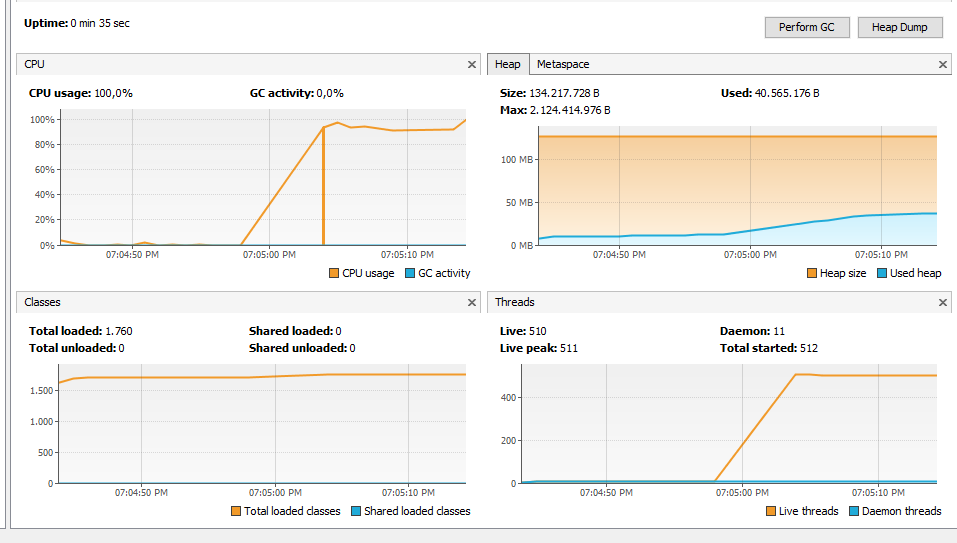
